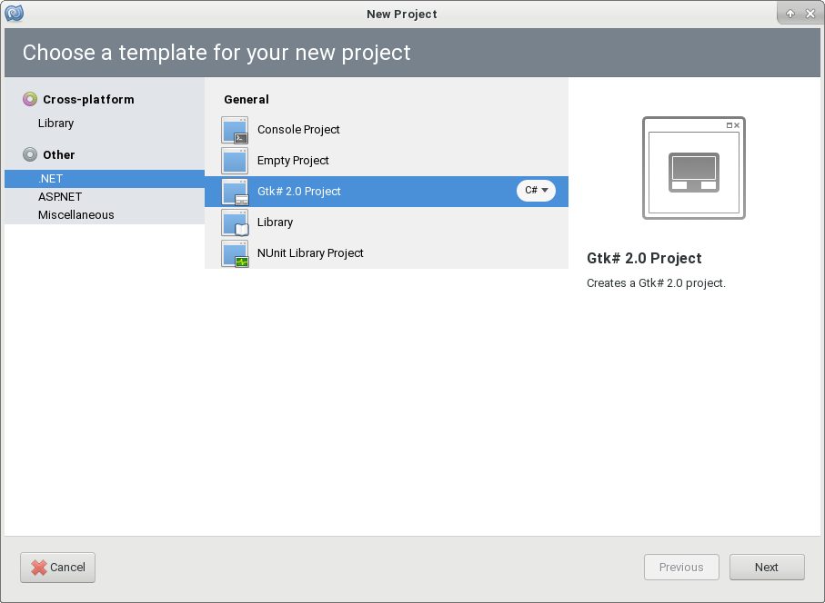
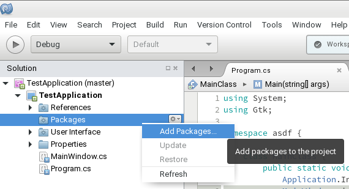
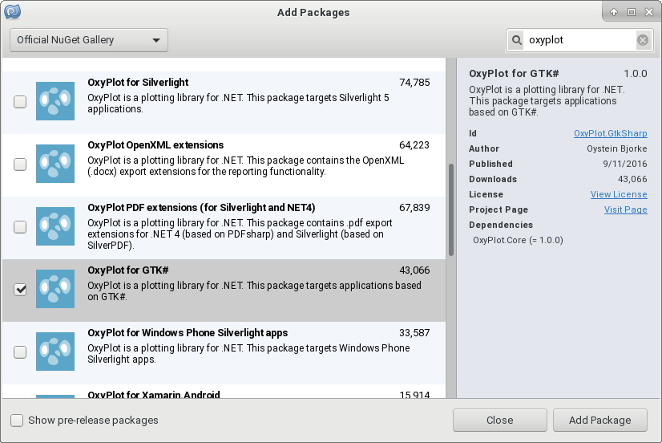
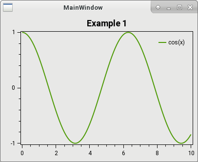

====
GTK#
====

This example shows how to create a simple GtkSharp2 application with a ``PlotView`` widget, where the content of the plot is defined in code as a ``PlotModel``.

Create project
--------------

To create a new project that should make use of OxyPlot, open either MonoDevelop or XamarinStudio, open the `New Project` dialog and select the `Gtk# 2.0 Project` template:

Add references
--------------

To prepare the new project for the use of OxyPlot, right-click the `References` subfolder of the project:

In the NuGet dialog, search for `OxyPlot` and install the `OxyPlot.GtkSharp` package:

Create the view
---------------

.. note:: Probably due to a `bug <https://bugzilla.xamarin.com/show_bug.cgi?id=38967>`_ in MonoDevelop, adding the ``PlotView`` widget with the designer does not work.

To add the ``PlotView`` widget through code, open the ``MainWindow``'s code and add the following lines to the constructor:

.. sourcecode:: csharp
	
	var plotView = new PlotView();
	this.Add(plotView);
	plotView.ShowAll();

	
Bind PlotModel
--------------

To create a simple ``PlotModel`` and display it in the ``PlotView`` widget, add the following code to the constructor:

.. sourcecode:: csharp

	var myModel = new PlotModel { Title = "Example 1" };
	myModel.Series.Add(new FunctionSeries(Math.Cos, 0, 10, 0.1, "cos(x)"));
	plotView.Model = myModel;
	
	
Result
------

The complete source code of the `MainWindow` should now look like this:

.. sourcecode:: csharp

	public partial class MainWindow: Gtk.Window {
		
		public MainWindow() : base(Gtk.WindowType.Toplevel) {
			Build();

			var plotView = new PlotView();
			this.Add(plotView);
			plotView.ShowAll();

			var myModel = new PlotModel { Title = "Example 1" };
			myModel.Series.Add(new FunctionSeries(Math.Cos, 0, 10, 0.1, "cos(x)"));
			plotView.Model = myModel;
		}

		protected void OnDeleteEvent(object sender, DeleteEventArgs a) {
			Application.Quit();
			a.RetVal = true;
		}

	}

And the resulting application should then look like this:

The source code can also be found in the `HelloWorld\\GtkApplication1 <https://github.com/oxyplot/documentation-examples/tree/master/HelloWorld/GtkApplication1>`_ folder in the `documentation-examples <https://github.com/oxyplot/documentation-examples>`_ repository.
