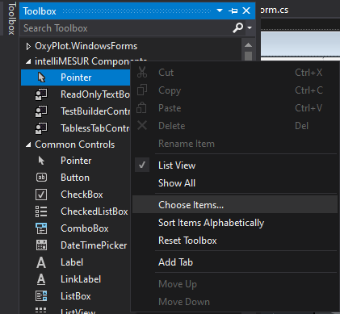
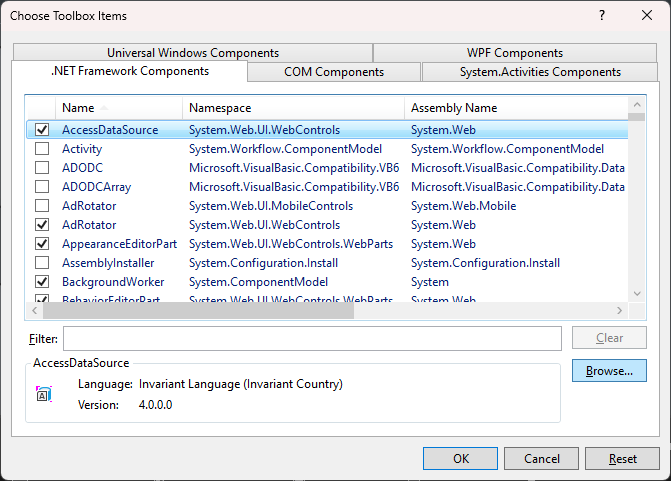
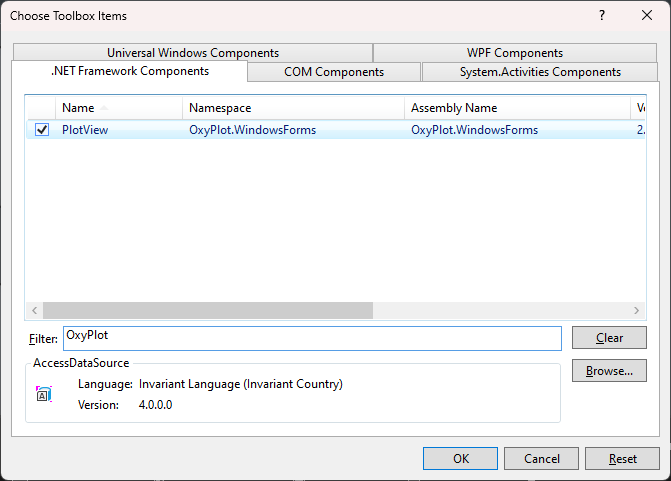

=============
Windows.Forms
=============

.. note:: This section is under construction. Please contribute!

Create project
--------------

Start Visual Studio and select "FILE -> New -> Project..." to create a new Windows Forms application:

.. image:: windows-forms-new-project.png

Add references
--------------

You need references to the OxyPlot and OxyPlot.WindowsForms assemblies. The easiest way to do this is to right click on the "References" item in the Solution Explorer and select "Manage NuGet Packages..." (this requires that the "NuGet Package Manager" extension is installed):

.. image:: windows-forms-add-reference.png

In the "Manage NuGet packages" dialog, search for "OxyPlot" in the top-right search textbox. 
Select the "OxyPlot.WindowsForms" package and click install:

.. image:: windows-forms-install-package.png

You can also use the `Package Manager Console <http://docs.nuget.org/docs/start-here/using-the-package-manager-console>`_ to install the package:

.. sourcecode:: bat

    PM> Install-Package OxyPlot.WindowsForms

Add to the Toolbox
------------------

You need to add the OxyPlot PlotView dll to the Toolbox. The fastest way to do this is to first build the project. This will populate the dll's from the nuget package pulled in earlier.

In the Toolbox, Right Click inside and select "Choose Items...". This will open the Choose Toolbox Items Window. It will take a little while to load all the .NET Framework Components. Once it has loaded them all click on the "Browse" Button below.

Inside the File Select folder that opened, navigate to the "OxyPlot.WindowsForms.dll" and Open it. This will add the OxyPlot PlotView Control to the ".NET Framework Components" List.

To enable the PlotView Component to show up in the Toolbox, in the filter enter in "OxyPlot" and it will narrow it down to just the Components added from the OxyPlot.WindowsForms.dll. Put a checkmark on the PlotView Component and it will now show up in your Toolbox.

Adding plot view
---------------

TODO (add explanation of adding PlotView to the Form)

Create the plot model
---------------------

.. sourcecode:: csharp

    namespace WindowsFormsApplication1
    {
        using System;
        using System.Windows.Forms;

        using OxyPlot;
        using OxyPlot.Series;

        public partial class Form1 : Form
        {
            public Form1()
            {
                this.InitializeComponent();
                var myModel = new PlotModel { Title = "Example 1" };
                myModel.Series.Add(new FunctionSeries(Math.Cos, 0, 10, 0.1, "cos(x)"));
                this.plot1.Model = myModel;
            }
        }
    }

The application should now look like this:

.. image:: windows-forms-example1.png

The source code can be found in the `HelloWorld\\WindowsFormsApplication1 <https://github.com/oxyplot/documentation-examples/tree/master/HelloWorld/WindowsFormsApplication1>`_ folder in the `documentation-examples <https://github.com/oxyplot/documentation-examples>`_ repository.
