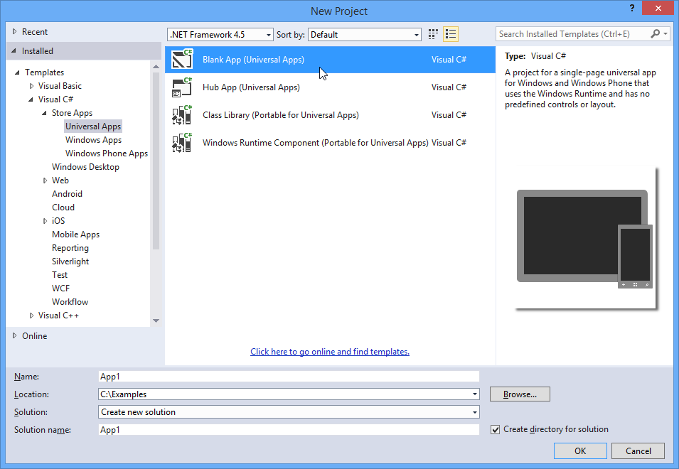
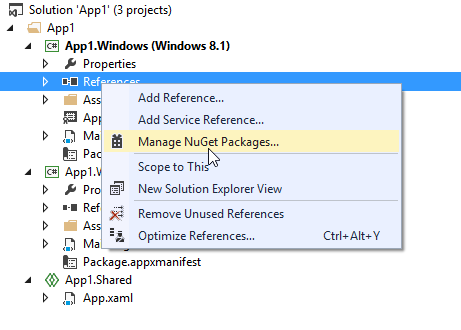
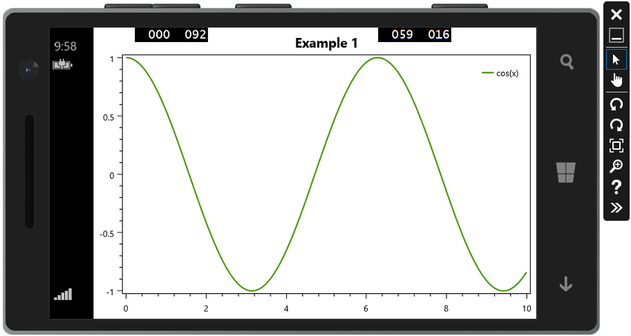

=================
Windows Universal
=================

.. note:: This section is under construction. Please contribute!

This example shows how to create apps for Windows and Windows Phone.

Create project
--------------

Start Visual Studio and select "FILE -> New -> Project...". Select "Store Apps -> Universal Apps -> Blank App" to 
create new projects for Windows and Windows Phone:

Add references
--------------

You need references to the `OxyPlot` and `OxyPlot.WindowsUniversal` assemblies. The easiest way to do this is to right click on the "References" item in the Solution Explorer and select "Manage NuGet Packages..." (this requires that the "NuGet Package Manager" extension is installed):

In the "Manage NuGet packages" dialog, search for "oxyplot universal" in the top-right search textbox. 
Select the "OxyPlot for Windows Universal apps" package and click install:

.. image:: windows-universal-app-install-package.png

You can also use the `Package Manager Console <http://docs.nuget.org/docs/start-here/using-the-package-manager-console>`_ to install the package:

.. sourcecode:: bat

    PM> Install-Package OxyPlot.WindowsUniversal

Create a view model
-------------------

Add a class that creates a ``PlotModel`` and a ``FunctionSeries``.

.. sourcecode:: csharp

    namespace UniversalApp1
    {
        using System;

        using OxyPlot;
        using OxyPlot.Series;

        public class MainViewModel
        {
            public MainViewModel()
            {
                this.MyModel = new PlotModel { Title = "Example 1" };
                this.MyModel.Series.Add(new FunctionSeries(Math.Cos, 0, 10, 0.1, "cos(x)"));
            }

            public PlotModel MyModel { get; private set; }
        }
    }

Create the view
---------------

Define the namespace in the ``Page`` element, set the ``DataContext`` and add a ``PlotView`` control:

.. sourcecode:: xml

    <Page
        x:Class="UniversalApp1.MainPage"
        xmlns="http://schemas.microsoft.com/winfx/2006/xaml/presentation"
        xmlns:x="http://schemas.microsoft.com/winfx/2006/xaml"
        xmlns:local="using:UniversalApp1"
        xmlns:d="http://schemas.microsoft.com/expression/blend/2008"
        xmlns:mc="http://schemas.openxmlformats.org/markup-compatibility/2006"
        xmlns:oxy="using:OxyPlot.WindowsUniversal"
        mc:Ignorable="d">
        <Page.DataContext>
            <local:MainViewModel/>
        </Page.DataContext>

        <Grid Background="{ThemeResource ApplicationPageBackgroundThemeBrush}">
            <oxy:PlotView Model="{Binding MyModel}"/>
        </Grid>
    </Page>

The application should now look like this (on the Windows Phone emulator):

The source code can be found in the `HelloWorld\\UniversalApp1 <https://github.com/oxyplot/documentation-examples/tree/master/HelloWorld/UniversalApp1>`_ folder in the `documentation-examples <https://github.com/oxyplot/documentation-examples>`_ repository.