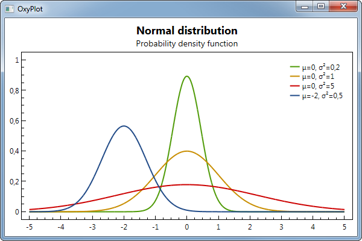

.. OxyPlot documentation master file, created by
   sphinx-quickstart on Thu Feb 19 21:10:54 2015.
   You can adapt this file completely to your liking, but it should at least
   contain the root `toctree` directive.

Welcome to OxyPlot's documentation!
===================================

.. note:: The documentation is under construction. Please contribute!

OxyPlot is a cross-platform plotting library for .NET

Content
-------

.. toctree::
   :maxdepth: 2

   introduction/index.rst
   getting-started/index.rst
   models/index.rst
   controllers/index.rst
   views/index.rst
   common-tasks/index.rst
   guidelines/index.rst
   export/index.rst
   extras/index.rst
   contribute/index.rst

Indices and tables
------------------

* :ref:`genindex`
* :ref:`modindex`
* :ref:`search`

