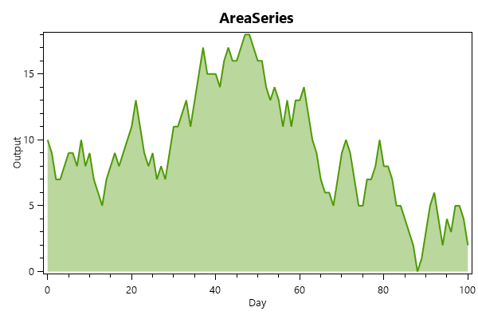

==========
AreaSeries
==========

.. note:: This section is under construction. Please contribute!

An ``AreaSeries`` shows an area between two lines defined by two sets
of points, or a set of points and a baseline.

Axes
----

An ``AreaSeries`` requires a horizontal and a vertical axis.

By default, the ``AreaSeries`` will use the default horizontal and
vertical axes in the parent ``PlotModel``. If there are more than one
horizontal/vertical axis, the axes can be specified by the ``XAxisKey``
and ``YAxisKey`` properties. This requires the ``Key`` property to be
set on the desired axes.

Data
----

Use the ``Points`` and ``Points2`` collections to add data points to
the first and second lines of the ``AreaSeries`` respectively:

.. code:: csharp

    areaSeries1.Points.Add(new DataPoint(0, 5));
    areaSeries1.Points.Add(new DataPoint(10, 8));

    areaSeries1.Points2.Add(new DataPoint(0, 2));
    areaSeries1.Points2.Add(new DataPoint(10, 1));

Alternatively, you can specify a collection in the ``ItemsSource`` properties.

- If the ``Mapping`` property is set, each element in the collection
  will be transformed
- If the collection is a list of ``DataPoint``, or a type that implements
  ``IDataPointProvider``, it will be used with no mapping
- If the ``DataFieldX`` and ``DataFieldY`` properties are set, each
  element of the collection will be reflected to create a data point
  for the first line
- If the ``DataFieldX2`` and ``DataFieldY2`` properties are set, each
  element of the collection will be reflected to create a data point
  for the second line

The ``Points2`` property will not be ignored if the ``ItemSource`` property
is non-null.

If no data points are provided for the second line, the baseline value
``ConstantY2`` along with ``X`` values of the first and last data points
in the first line will be used instead.

Tracker
-------

The ``TrackerFormatString`` property is used to format the string shown
in the `tracker`_. The format string may use the following arguments:

-  ``{0}`` the title of the series
-  ``{1}`` the title of the x-axis
-  ``{2}`` the x-value
-  ``{3}`` the title of the y-axis
-  ``{4}`` the y-value
-  ``{PropertyX}`` the value of ``PropertyX`` in the item (extended
   format string syntax)

To show the x and y values with one digit, use the format string
``"{2:0.0},{4:0.0}"``.

If an item was hit, it is also possible to use the extended format
string syntax, e.g. ``{PropertyX:0.##}``, where the value of
``PropertyX`` will be found by reflection of the item.

The default format string for ``AreaSeries`` is
``"{0}\n{1}: {2}\n{3}: {4}"``

See `MSDN`_ for more information about format strings.

The ``TrackerKey`` property may be used to specify a `custom tracker`_.
This makes it possible to use different trackers for each series.

Color and Style
---------------

The ``Color`` and ``Color2`` properties determine the colors of the first and second
line respective. The default value of ``Color2`` is ``Automatic``, which causes the
second line to have the same color as the first. The default value of ``Color`` is
``Automatic``. In this case the color will be set automatically from the colors
specified in the ``DefaultColors`` property of the parent ``PlotModel``.

The ``LineStyle`` defines the line style. The default is ``Solid``. The
``StrokeThickness`` defines the thickness of lines.

Markers can be included by specifying the ``MarkerType`` and ``MarkerStroke``. The
default ``MarkerType`` is ``None``. If the ``Custom`` marker type is used, then a
list of relative screen points in screen-space must be provided in the
``MarkerOutline`` property.

The ``MarkerStroke`` defines the stroke color of the markers. The ``MarkerFill``
defines the fill color of the markers. The ``MarkerStrokeThickness`` defines the
thickness of the lines in the marker. The ``MarkerSize`` defines the size of the
markers.

The ``Fill`` defines the color of the fill color of the areas. The default value is
``Automatic``. In this case the color will be set automatically based on the color
of the first line.

Example
-------

.. sourcecode:: csharp

    var model = new PlotModel { Title = "AreaSeries" };
    model.Axes.Add(new LinearAxis() { Title = "Day", Position = AxisPosition.Bottom });
    model.Axes.Add(new LinearAxis() { Title = "Output", Position = AxisPosition.Left });

    var areaSeries = new AreaSeries() { Color2 = OxyColors.Transparent };

    var r = new Random(1);
    var dailyOutput = 10;
    for (int i = 0; i <= 100; i++)
    {
        areaSeries.Points.Add(new DataPoint(i, dailyOutput));

        dailyOutput = Math.Max(0, dailyOutput + r.Next(-2, 3));
    }

    model.Series.Add(areaSeries);

.. _tracker: ../tracker
.. _MSDN: http://msdn.microsoft.com/en-us/library/system.string.format(v=vs.110).aspx
.. _custom tracker: ../tracker
