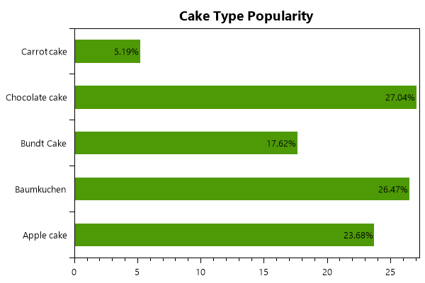

=========
BarSeries
=========

.. note:: This section is under construction. Please contribute!

A ``BarSeries`` shows the data as horizontal bars.

Axes
----

A vertical ``CategoryAxis`` and a horizontal ``LinearAxis`` is required.

Tracker
-------

The format string may use the following arguments:

- ``{0}`` the title of the series
- ``{1}`` the category
- ``{2}`` the bar value
- ``{PropertyX}`` the value of ``PropertyX`` in the item (extended format string syntax)

To show only the value with one digit, use the format string ``"{2:0.0}"``.

If an item was hit, it is also possible to use the extended format string syntax, e.g. ``{PropertyX:0.##}``, where the value of ``PropertyX`` will be found by reflection of the item.

The default format string for ``BarSeries`` is ``"{0}\n{1}: {2}"``

See `MSDN <http://msdn.microsoft.com/en-us/library/system.string.format(v=vs.110).aspx>`_ for more information about format strings.

Example
-------

.. sourcecode:: csharp

    var model = new PlotModel { Title = "BarSeries" };
    var barSeries = new BarSeries();
    model.Series.Add(barSeries);
