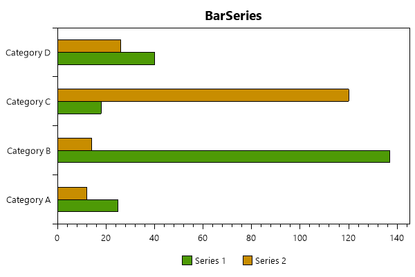

=========
BarSeries
=========

.. note:: This section is under construction. Please contribute!

A ``BarSeries`` shows the data as horizontal bars.

Axes
----

A vertical ``CategoryAxis`` and a horizontal ``LinearAxis`` is required.

Tracker
-------

The format string may use the following arguments:

- ``{0}`` the title of the series
- ``{1}`` the category
- ``{2}`` the bar value
- ``{PropertyX}`` the value of ``PropertyX`` in the item (extended format string syntax)

To show only the value with one digit, use the format string ``"{2:0.0}"``.

If an item was hit, it is also possible to use the extended format string syntax, e.g. ``{PropertyX:0.##}``, where the value of ``PropertyX`` will be found by reflection of the item.

The default format string for ``BarSeries`` is ``"{0}\n{1}: {2}"``

See `MSDN <http://msdn.microsoft.com/en-us/library/system.string.format(v=vs.110).aspx>`_ for more information about format strings.

Example(simple)
-------

Here a simple example making use of very basic functionality to visualize the popularity of 5 different types of cake.

.. image:: BarSeries.png

.. sourcecode:: csharp

	var model = new PlotModel{ Title = "Cake Type Popularity" };

	//generate a random percentage distribution between the 5
	//cake-types (see axis below)
	var rand = new Random();
	double[] cakePopularity = new double[5];
	for(int i = 0; i < 5; ++i) {
		cakePopularity[i] = rand.NextDouble();
	}
	var sum = cakePopularity.Sum();

	var barSeries = new BarSeries
	{
		ItemsSource = new List<BarItem>(new[]
		{
			new BarItem{ Value = (cakePopularity[0] / sum * 100) },
			new BarItem{ Value = (cakePopularity[1] / sum * 100) },
			new BarItem{ Value = (cakePopularity[2] / sum * 100) },
			new BarItem{ Value = (cakePopularity[3] / sum * 100) },
			new BarItem{ Value = (cakePopularity[4] / sum * 100) }
		}),
		LabelPlacement = LabelPlacement.Inside,
		LabelFormatString = "{0:.00}%"
	};
	model.Series.Add(barSeries);

	model.Axes.Add(new CategoryAxis
	{
		Position = AxisPosition.Left,
		Key = "CakeAxis",
		ItemsSource = new[]
		{
			"Apple cake",
			"Baumkuchen",
			"Bundt Cake",
			"Chocolate cake",
			"Carrot cake"
		}
	});

	
Example(grouped)
-------

Here a more advanced example making use of grouping to always compare the two series' values.

.. sourcecode:: csharp

	var model = new PlotModel
	{
		Title = "BarSeries",
		LegendPlacement = LegendPlacement.Outside,
		LegendPosition = LegendPosition.BottomCenter,
		LegendOrientation = LegendOrientation.Horizontal,
		LegendBorderThickness = 0
	};

	var s1 = new BarSeries { Title = "Series 1", StrokeColor = OxyColors.Black, StrokeThickness = 1 };
	s1.Items.Add(new BarItem { Value = 25 });
	s1.Items.Add(new BarItem { Value = 137 });
	s1.Items.Add(new BarItem { Value = 18 });
	s1.Items.Add(new BarItem { Value = 40 });

	var s2 = new BarSeries { Title = "Series 2", StrokeColor = OxyColors.Black, StrokeThickness = 1 };
	s2.Items.Add(new BarItem { Value = 12 });
	s2.Items.Add(new BarItem { Value = 14 });
	s2.Items.Add(new BarItem { Value = 120 });
	s2.Items.Add(new BarItem { Value = 26 });

	var categoryAxis = new CategoryAxis { Position = AxisPosition.Left };
	categoryAxis.Labels.Add("Category A");
	categoryAxis.Labels.Add("Category B");
	categoryAxis.Labels.Add("Category C");
	categoryAxis.Labels.Add("Category D");
	var valueAxis = new LinearAxis { Position = AxisPosition.Bottom, MinimumPadding = 0, MaximumPadding = 0.06, AbsoluteMinimum = 0 };
	model.Series.Add(s1);
	model.Series.Add(s2);
	model.Axes.Add(categoryAxis);
	model.Axes.Add(valueAxis);
