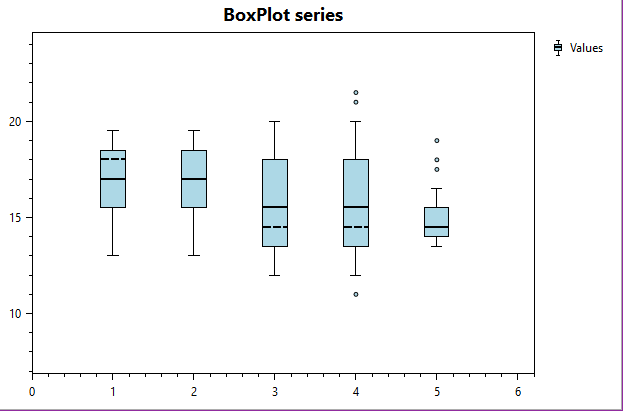

=============
BoxPlotSeries
=============

.. note:: This section is under construction. Please contribute!

A ``BoxPlotSeries`` shows a set of points. The points can also have a size and color value.

Axes
----

- TODO

Data
----

- TODO

Tracker
-------

The tracker format string may use the following arguments:

- ``{0}`` the title of the series
- ``{1}`` the title of the x-axis
- ``{2}`` the x-value
- ``{3}`` the value of the upper whisker
- ``{4}`` the value of the third quartil
- ``{5}`` the value of the median
- ``{6}`` the value of the first quartil
- ``{7}`` the value of the lower whisker
- ``{PropertyX}`` the value of ``PropertyX`` in the item (extended format string syntax)

To show only the median value with one digit, use the format string ``"{5:0.0}"``.

The default format string for ``BoxPlotSeries`` is ``"{0}\n{1}: {2}\nUpper Whisker: {3:0.00}\nThird Quartil: {4:0.00}\nMedian: {5:0.00}\nFirst Quartil: {6:0.00}\nLower Whisker: {7:0.00}"``

Example
-------

.. sourcecode:: csharp

    var model = new PlotModel { Title = "BoxPlotSeries" };
