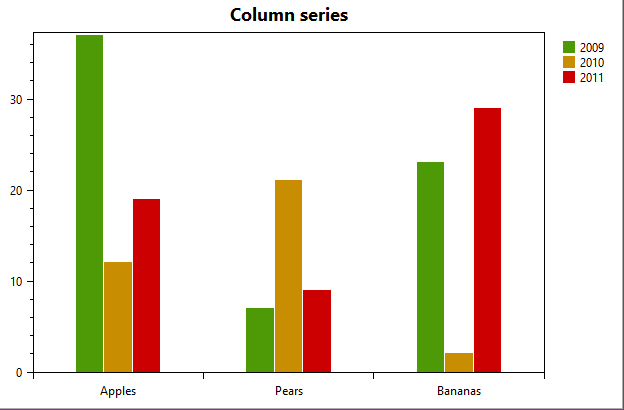

============
ColumnSeries
============

.. note:: This section is under construction. Please contribute!

A ``ColumnSeries`` shows the data set as vertical columns.

Axes
----

Data
----

Tracker
-------

The format string may use the following arguments:

- ``{0}`` the title of the series
- ``{1}`` the category
- ``{2}`` the column value
- ``{PropertyX}`` the value of ``PropertyX`` in the item (extended format string syntax)

To show the column value with one digit, use the format string ``"{2:0.0}"``.

The default format string for ``ColumnSeries`` is ``"{0}\n{1}: {2}"``

Example
-------

.. sourcecode:: csharp

    var model = new PlotModel { Title = "ColumnSeries" };
    // A ColumnSeries requires a CategoryAxis on the x-axis.
    model.Axes.Add(new CategoryAxis());
    var series = new ColumnSeries();
    model.Series.Add(series);
    series.Items.Add(new ColumnItem(100));
