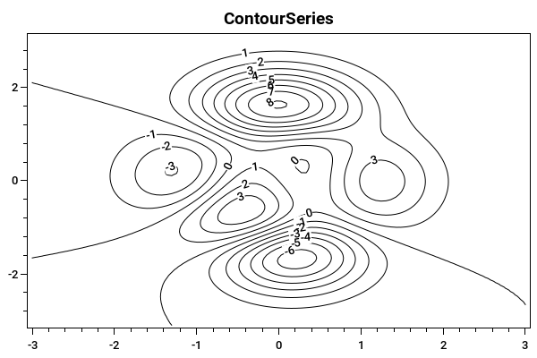

=============
ContourSeries
=============

.. note:: This section is under construction. Please contribute!

A ``ContourSeries`` renders a 2D array of values as contours.

Axes
----

Data
----

Tracker
-------

The format string may use the following arguments:

- ``{0}`` the title of the series
- ``{1}`` the title of the x-axis
- ``{2}`` the x-value
- ``{3}`` the title of the y-axis
- ``{4}`` the y-value
- ``{5}`` the title of the contour level axis
- ``{6}`` the contour level
- ``{PropertyX}`` the value of ``PropertyX`` in the item (extended format string syntax)

To show the contour level with one digit, use the format string ``"{6:0.0}"``.

The default format string for ``ContourSeries`` is ``"{0}\n{1}: {2}\n{3}: {4}\n{5}: {6}"``

Example
-------

.. sourcecode:: csharp

	var model = new PlotModel { Title = "ContourSeries" };
	
	double x0 = -3.1;
	double x1 = 3.1;
	double y0 = -3;
	double y1 = 3;
	
	//generate values
	Func<double, double, double> peaks = (x, y) => 3 * (1 - x) * (1 - x) * Math.Exp(-(x * x) - (y + 1) * (y + 1)) - 10 * (x / 5 - x * x * x - y * y * y * y * y) * Math.Exp(-x * x - y * y) - 1.0 / 3 * Math.Exp(-(x + 1) * (x + 1) - y * y);
	var xx = ArrayBuilder.CreateVector(x0, x1, 100);
	var yy = ArrayBuilder.CreateVector(y0, y1, 100);
	var peaksData = ArrayBuilder.Evaluate(peaks, xx, yy);

	var cs = new ContourSeries
	{
		Color = OxyColors.Black,
		LabelBackground = OxyColors.White,
		ColumnCoordinates = xx,
		RowCoordinates = yy,
		Data = peaksData
	};
	model.Series.Add(cs);
