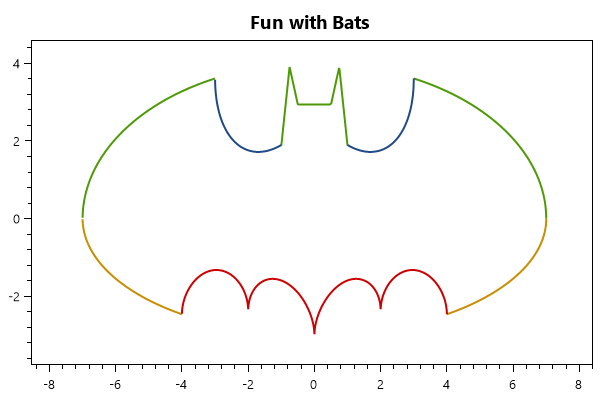

==============
FunctionSeries
==============

.. note:: This section is under construction. Please contribute!

A ``FunctionSeries`` shows a function plotted as a line.

Tracker
-------

The format string may use the following arguments:

- ``{0}`` the title of the series
- ``{1}`` the title of the x-axis
- ``{2}`` the x-value
- ``{3}`` the title of the y-axis
- ``{4}`` the y-value
- ``{PropertyX}`` the value of ``PropertyX`` in the item (extended format string syntax)

To show the x and y values with one digit, use the format string ``"{2:0.0},{4:0.0}"``.

The default format string for ``FunctionSeries`` is ``"{0}\n{1}: {2:0.###}\n{3}: {4:0.###}"``

Example
-------

This example shows multiple functions combined by one ``PlotModel``, displaying the well-known ``Batman-Curve``.

.. sourcecode:: csharp

	var model = new PlotModel{ Title = "Fun with Bats" };

	Func<double, double> batFn1 = (x) => 2 * Math.Sqrt(-Math.Abs(Math.Abs(x) - 1) * Math.Abs(3 - Math.Abs(x)) / ((Math.Abs(x) - 1) * (3 - Math.Abs(x)))) * (1 + Math.Abs(Math.Abs(x) - 3) / (Math.Abs(x) - 3)) * Math.Sqrt(1 - Math.Pow((x / 7), 2)) + (5 + 0.97 * (Math.Abs(x - 0.5) + Math.Abs(x + 0.5)) - 3 * (Math.Abs(x - 0.75) + Math.Abs(x + 0.75))) * (1 + Math.Abs(1 - Math.Abs(x)) / (1 - Math.Abs(x)));
	Func<double, double> batFn2 = (x) => -3 * Math.Sqrt(1 - Math.Pow((x / 7), 2)) * Math.Sqrt(Math.Abs(Math.Abs(x) - 4) / (Math.Abs(x) - 4));
	Func<double, double> batFn3 = (x) => Math.Abs(x / 2) - 0.0913722 * (Math.Pow(x, 2)) - 3 + Math.Sqrt(1 - Math.Pow((Math.Abs(Math.Abs(x) - 2) - 1), 2));
	Func<double, double> batFn4 = (x) => (2.71052 + (1.5 - .5 * Math.Abs(x)) - 1.35526 * Math.Sqrt(4 - Math.Pow((Math.Abs(x) - 1), 2))) * Math.Sqrt(Math.Abs(Math.Abs(x) - 1) / (Math.Abs(x) - 1)) + 0.9;

	model.Series.Add(new FunctionSeries(batFn1, -8, 8, 0.0001));
	model.Series.Add(new FunctionSeries(batFn2, -8, 8, 0.0001));
	model.Series.Add(new FunctionSeries(batFn3, -8, 8, 0.0001));
	model.Series.Add(new FunctionSeries(batFn4, -8, 8, 0.0001));

	model.Axes.Add(new LinearAxis{ Position = AxisPosition.Bottom, MaximumPadding = 0.1, MinimumPadding = 0.1 });
	model.Axes.Add(new LinearAxis{ Position = AxisPosition.Left, MaximumPadding = 0.1, MinimumPadding = 0.1 });

	return model;
