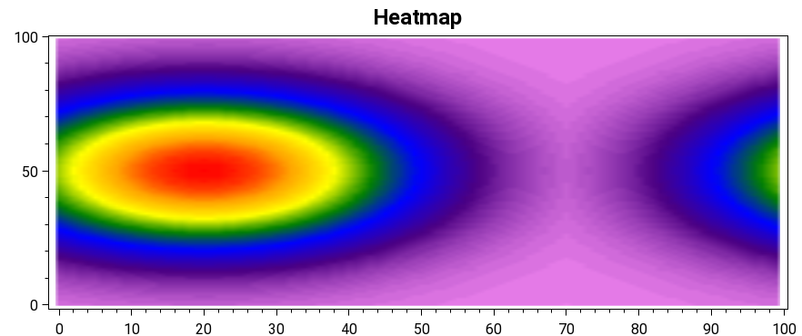
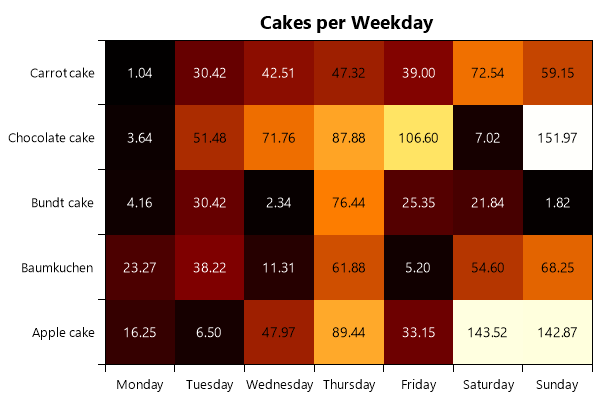

=============
HeatMapSeries
=============

.. note:: This section is under construction. Please contribute!

A ``HeatMapSeries`` shows a 2D array of values as a heat map.

Tracker
-------

The format string may use the following arguments:

- ``{0}`` the title of the series
- ``{1}`` the title of the x-axis
- ``{2}`` the x-value
- ``{3}`` the title of the y-axis
- ``{4}`` the y-value
- ``{5}`` the title of the value/color-axis
- ``{6}`` the color-value
- ``{PropertyX}`` the value of ``PropertyX`` in the item (extended format string syntax)

To show the x and y values with one digit, use the format string ``"{2:0.0},{4:0.0}"``.

The default format string for ``HeatMapSeries`` is ``"{0}\n{1}: {2}\n{3}: {4}\n{5}: {6}"``

Example (Linear, Bitmap)
-------

.. sourcecode:: csharp

            var model = new PlotModel { Title = "Heatmap" };

            // Color axis (the X and Y axes are generated automatically)
            model.Axes.Add(new LinearColorAxis
            {
                Palette = OxyPalettes.Rainbow(100)
            });

            // generate 1d normal distribution
            var singleData = new double[100];
            for (int x = 0; x < 100; ++x)
            {
                singleData[x] = Math.Exp((-1.0 / 2.0) * Math.Pow(((double)x - 50.0) / 20.0, 2.0));
            }

            // generate 2d normal distribution
            var data = new double[100, 100];
            for (int x = 0; x < 100; ++x)
            {
                for (int y = 0; y < 100; ++y)
                {
                    data[y, x] = singleData[x] * singleData[(y + 30) % 100] * 100;
                }
            }

            var heatMapSeries = new HeatMapSeries
            {
                X0 = 0,
                X1 = 99,
                Y0 = 0,
                Y1 = 99,
                Interpolate = true,
                RenderMethod = HeatMapRenderMethod.Bitmap,
                Data = data
            };

            model.Series.Add(heatMapSeries);
    
Example (Categorized, Rectangle)
-------

The following diagram has categories on both, the x-axis and the y-axis.

It visualizes the amount of cake (y-axis) consumed on the specific day of week (x-axis). As can be seen in the diagram, the amount of cake rises from Monday to Sunday.

.. sourcecode:: csharp

            var model = new PlotModel { Title = "Cakes per Weekday" };

            // Weekday axis (horizontal)
            model.Axes.Add(new CategoryAxis
            {
                Position = AxisPosition.Bottom,

                // Key used for specifying this axis in the HeatMapSeries
                Key = "WeekdayAxis",

                // Array of Categories (see above), mapped to one of the coordinates of the 2D-data array
                ItemsSource = new[]
                {
                        "Monday",
                        "Tuesday",
                        "Wednesday",
                        "Thursday",
                        "Friday",
                        "Saturday",
                        "Sunday"
                }
            });

            // Cake type axis (vertical)
            model.Axes.Add(new CategoryAxis
            {
                Position = AxisPosition.Left,
                Key = "CakeAxis",
                ItemsSource = new[]
                {
                        "Apple cake",
                        "Baumkuchen",
                        "Bundt cake",
                        "Chocolate cake",
                        "Carrot cake"
                }
            });

            // Color axis
            model.Axes.Add(new LinearColorAxis
            {
                Palette = OxyPalettes.Hot(200)
            });

            var rand = new Random();
            var data = new double[7, 5];
            for (int x = 0; x < 5; ++x)
            {
                for (int y = 0; y < 7; ++y)
                {
                    data[y, x] = rand.Next(0, 200) * (0.13 * (y + 1));
                }
            }

            var heatMapSeries = new HeatMapSeries
            {
                X0 = 0,
                X1 = 6,
                Y0 = 0,
                Y1 = 4,
                XAxisKey = "WeekdayAxis",
                YAxisKey = "CakeAxis",
                RenderMethod = HeatMapRenderMethod.Rectangles,
                LabelFontSize = 0.2, // neccessary to display the label
                Data = data
            };

            model.Series.Add(heatMapSeries);
