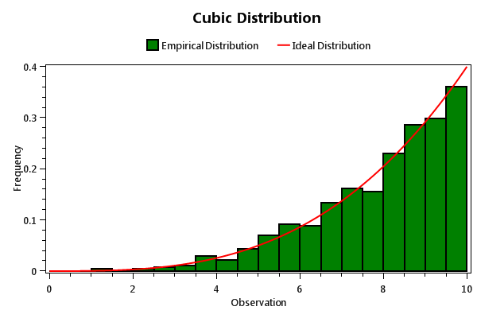

===============
HistogramSeries
===============

.. note:: This section is under construction. Please contribute!

.. note:: The ``HistogramSeries`` is currently only available in a pre-release package

A ``HistogramSeries`` shows areas on a ``LinearAxis``.

Axes
----

A vertical ``LinearAxis`` and a horizontal ``LinearAxis`` is required.

By default, the ``HistogramSeries`` will use the default horizontal and
vertical axes in the parent ``PlotModel``. If there are more than one
horizontal/vertical axis, the axes can be specified by the ``XAxisKey``
and ``YAxisKey`` properties. This requires the ``Key`` property to be
set on the desired axes.

Data
----

Use the ``Items`` collection to add data to the ``HistogramSeries``:

.. code:: csharp

    histogramSeries1.Items.Add(new HistogramItem(rangeStart: 0.0, rangeEnd: 0.5, area: 0.7, 14));
    histogramSeries1.Items.Add(new HistogramItem(rangeStart: 0.5, rangeEnd: 0.75, area: 0.2, 2));
    histogramSeries1.Items.Add(new HistogramItem(rangeStart: 0.75, rangeEnd: 1.0, area: 0.1, 1));

You can generate a list of ``HistogramItem`` from sample data with the static ``Collect`` methods provided by the ``HistogramHelpers`` class.

.. code:: csharp

    var bins = HistogramHelpers.CreateUniformBins(samples.Min(), samples.Max(), 10);
    var binningOptions = new BinningOptions(BinningOutlierMode.RejectOutliers, BinningIntervalType.InclusiveLowerBound, BinningExtremeValueMode.IncludeExtremeValues);
    histogramSeries1.Items.AddRange(HistogramHelpers.Collect(samples, bins, binningOptions);

Alternatively, you can specify a collection in the ``ItemsSource``
property.

- If the ``Mapping`` property is set, each element in the collection
  will be transformed
- If the collection is a list of ``HistogramItem``, it will be used with no
  mapping

Tracker
-------

The tracker format string may use the following arguments:

- ``{0}`` the title of the series
- ``{1}`` the x-axis title
- ``{2}`` the x-axis position
- ``{3}`` the y-axis title
- ``{4}`` the y-axis position
- ``{5}`` the range start of the area
- ``{6}`` the range end of the area
- ``{7}`` the value (height) of the area
- ``{8}`` the area (width * height) of the area
- ``{PropertyX}`` the value of ``PropertyX`` in the item (extended format string syntax)

To show only the value with one digit, use the format string ``"{2:0.0}"``.

If an item was hit, it is also possible to use the extended format string syntax, e.g. ``{PropertyX:0.##}``, where the value of ``PropertyX`` will be found by reflection of the item.

The default tracker format string for ``HistogramSeries`` is ``"Start: {5}\nEnd: {6}\nValue: {7}\nArea: {8}"``

See `MSDN <http://msdn.microsoft.com/en-us/library/system.string.format(v=vs.110).aspx>`_ for more information about format strings.

Example
-------

Here is an example making use of one of the ``HistogramHelpers.Collect`` methods to plot a distribution of samples drawn from a random distribution with 20 bins.

.. sourcecode:: csharp

    // prepare the model
    var model = new PlotModel()
    {
        Title = "Cubic Distribution",
        LegendPlacement = LegendPlacement.Outside,
        LegendPosition = LegendPosition.TopCenter,
        LegendOrientation = LegendOrientation.Horizontal
    };

    // add two linear axes
    model.Axes.Add(new LinearAxis() { Title = "Observation", Position = AxisPosition.Bottom });
    model.Axes.Add(new LinearAxis() { Title = "Frequency", Position = AxisPosition.Left });
            
    // generate random samples from a polynomial distribution
    double power = 3;
    double max = 10.0;
    int sampleCount = 1000;

    double integral = Math.Pow(max, power + 1) / (power + 1);

    var rnd = new Random(0);
    List<double> samples = new List<double>();
    for (int i = 0; i < sampleCount; i++)
    {
        samples.Add(Math.Pow(rnd.NextDouble() * (power + 1) * integral, 1.0 / (power + 1)));
    }

    // plot histogram of samples
    var histogramSeries = new HistogramSeries()
    {
        Title = "Empirical Distribution",
        FillColor = OxyColors.Green,
        StrokeColor = OxyColors.Black,
        StrokeThickness = 2
    };

    var bins = HistogramHelpers.CreateUniformBins(0, max, 20);
    var binningOptions = new BinningOptions(BinningOutlierMode.RejectOutliers, BinningIntervalType.InclusiveLowerBound, BinningExtremeValueMode.IncludeExtremeValues);
    var items = HistogramHelpers.Collect(samples, bins, binningOptions);

    histogramSeries.Items.AddRange(items);
    model.Series.Add(histogramSeries);

    // plot ideal line for comparison
    var functionSeries = new FunctionSeries(x => Math.Pow(x, power) / integral, 0, max, 1000)
    {
        Title = "Ideal Distribution",
        Color = OxyColors.Red
    };
    model.Series.Add(functionSeries);

Color and Style
---------------

The ``FillColor`` defines the color of the fill color of the areas. The default value is
``Automatic``. In this case the color will be set automatically from the
colors specified in the ``DefaultColors`` property of the parent ``PlotModel``.

The ``StrokeColor`` defines the color of the outline color of the areas. The default value is
``OxyColors.Black``. The ``StrokeThickness`` defines the thickness of the area outline. The default value is ``0``

Labels
---------------

The label format string may use the following arguments:

- ``{0}`` the value (height) of the area
- ``{PropertyX}`` the value of ``PropertyX`` in the item (extended format string syntax)

The default label format string is ``null``, which prevents any label from being shown.

The ``LabelPlacement`` property may take any of the following parameters:

 - ``Base`` the labels are positioned at the base of each area
 - ``Middle`` the labels are positioned at the middle of each area
 - ``Inside`` the labels are positioned at the extreme of each area, within the area
 - ``Outside`` the labels are positioned at the extreme of each area, outisde the area

This image shows the different options visually, with a ``LabelFormatString`` of ``{0}``.

 .. image:: HistogramSeriesLabelPlacement.png