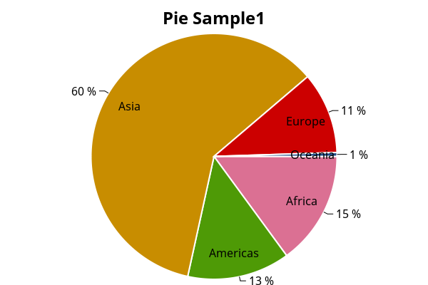

=========
PieSeries
=========

.. note:: This section is under construction. Please contribute!

A ``PieSeries`` renders a pie chart. Only one pie series is supported per ``PlotModel``.

Tracker
-------

The format string may use the following arguments:

- ``{0}`` the title of the series
- ``{1}`` the label of the pie slice
- ``{2}`` the value of the pie slice
- ``{3}`` the percentage of the pie slice
- ``{PropertyX}`` the value of ``PropertyX`` in the item (extended format string syntax)

To show the values with one digit, use the format string ``"{2:0.0}"``.

The default format string for ``PieSeries`` is ``"{1}: {2:0.###} ({3:P1})"``

Example
-------

.. sourcecode:: csharp

    var model = new PlotModel { Title = "PieSeries" };
