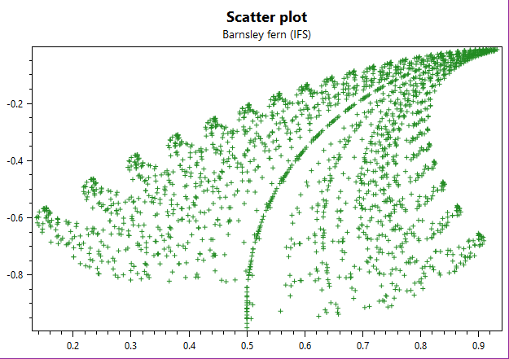

=============
ScatterSeries
=============

.. note:: This section is under construction. Please contribute!

A ``ScatterSeries`` shows a set of points. The points can also have a size and color value.

Axes
----

A ``ScatterSeries`` requires a horizontal and a vertical axis.

By default, the ``ScatterSeries`` will use the default horizontal and
vertical axes in the parent ``PlotModel``. If there are more than one
horizontal/vertical axis, the axes can be specified by the ``XAxisKey``
and ``YAxisKey`` properties. This requires the ``Key`` property to be
set on the desired axes.

Data
----

Use the ``Points`` collection to add data to the ``ScatterSeries``:

.. code:: csharp

    scatterSeries1.Points.Add(new ScatterPoint(10, 20));
    scatterSeries1.Points.Add(new ScatterPoint(30, 80, size: 8, value: 8, tag: "B"));

Each ``ScatterPoint`` has 5 properties:

- ``X``: the X coordinate
- ``X``: the X coordinate
- ``Size``: the rendered size of the point, with default ``NaN``
- ``Value``: the logical value of the point, with default ``NaN``
- ``Tag``: an arbitrary tag, with default ``null``

Alternatively, you can specify a collection in the ``ItemsSource``
property.

- If the ``Mapping`` property is set, each element in the collection
  will be transformed
- If the collection is a list of ``DataPoint``, or a type that implements
  ``IScatterPointProvider``, it will be used with no mapping
- If the ``DataFieldX`` and ``DataFieldY`` properties are set, each
  element of the collection will be reflected to create a scatter point
  from these two fields, as well as the ``DataFieldSize``,
  ``DataFieldValue``, and ``DataFieldTag`` fields

Tracker
-------

The format string may use the following arguments:

- ``{0}`` the title of the series
- ``{1}`` the title of the x-axis
- ``{2}`` the x-value
- ``{3}`` the title of the y-axis
- ``{4}`` the y-value
- ``{5}`` the title of the value/color-axis
- ``{6}`` the color-value
- ``{PropertyX}`` the value of ``PropertyX`` in the item (extended format string syntax)

To show the x and y values with one digit, use the format string ``"{2:0.0},{4:0.0}"``.

If an item was hit, it is also possible to use the extended format
string syntax, e.g. ``{PropertyX:0.##}``, where the value of
``PropertyX`` will be found by reflection of the item.

The default format string for ``ScatterSeries`` is ``"{0}\n{1}: {2:0.###}\n{3}: {4:0.###}"``

See `MSDN`_ for more information about format strings.

The ``TrackerKey`` property may be used to specify a `custom tracker`_.
This makes it possible to use different trackers for each series.

Color and Style
---------------

The ``MarkerType`` defines the type of markers to plot. The default is ``Square``.
If the ``Custom`` marker type is used, then a list of relative screen points in
screen-space must be provided in the ``MarkerOutline`` property.

The ``MarkerStroke`` defines the stroke color of the markers. The ``MarkerFill``
defines the fill color of the markers. The ``MarkerStrokeThickness`` defines the
thickness of the lines in the marker.

The ``Size`` property of each point determines the size of the plotted marker.
If a point has the default size of ``NaN``, then its size will be determined by
the ``MarkerSize`` property.

If a ``ColorAxis`` is defined, the color of each point will be determined by its
value. Points with a ``Value`` of ``NaN`` will not be plotted.

Example
-------

.. sourcecode:: csharp

    var model = new PlotModel { Title = "ScatterSeries" };
    var scatterSeries = new ScatterSeries { MarkerType = MarkerType.Circle };
    var r = new Random(314);
    for (int i = 0; i < 100; i++)
    {
        var x = r.NextDouble();
        var y = r.NextDouble();
        var size = r.Next(5, 15);
        var colorValue = r.Next(100, 1000);
        scatterSeries.Points.Add(new ScatterPoint(x, y, size, colorValue));
    }

    model.Series.Add(scatterSeries);
    model.Axes.Add(new LinearColorAxis { Position = AxisPosition.Right, Palette = OxyPalettes.Jet(200) });

.. _tracker: ../tracker
.. _MSDN: http://msdn.microsoft.com/en-us/library/system.string.format(v=vs.110).aspx
.. _custom tracker: ../tracker
