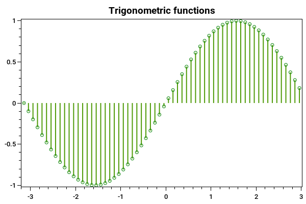

==========
StemSeries
==========

.. note:: This section is under construction. Please contribute!

A ``StemSeries`` shows stems to each data point.

Tracker
-------

The format string may use the following arguments:

- ``{0}`` the title of the series
- ``{1}`` the title of the x-axis
- ``{2}`` the x-value
- ``{3}`` the title of the y-axis
- ``{4}`` the y-value
- ``{PropertyX}`` the value of ``PropertyX`` in the item (extended format string syntax)

To show the x and y values with one digit, use the format string ``"{2:0.0},{4:0.0}"``.

The default format string for ``StemSeries`` is ``"{0}\n{1}: {2:0.###}\n{3}: {4:0.###}"``

Example
-------

.. sourcecode:: csharp

	var model = new PlotModel{ Title = "Trigonometric functions" };

	var start = -Math.PI;
	var end = Math.PI;
	var step = 0.1;
	int steps = (int)((Math.Abs(start) + Math.Abs(end)) / step);

	//generate points for functions
	var sinData = new DataPoint[steps];
	for (int i = 0; i < steps; ++i)
	{
		var x = (start + step * i);
		sinData[i] = new DataPoint(x, Math.Sin(x));
	}

	//sin(x)
	var sinStemSeries = new StemSeries
	{
		MarkerStroke = OxyColors.Green,
		MarkerType = MarkerType.Circle
	};
	sinStemSeries.Points.AddRange(sinData);

	model.Series.Add(sinStemSeries);
